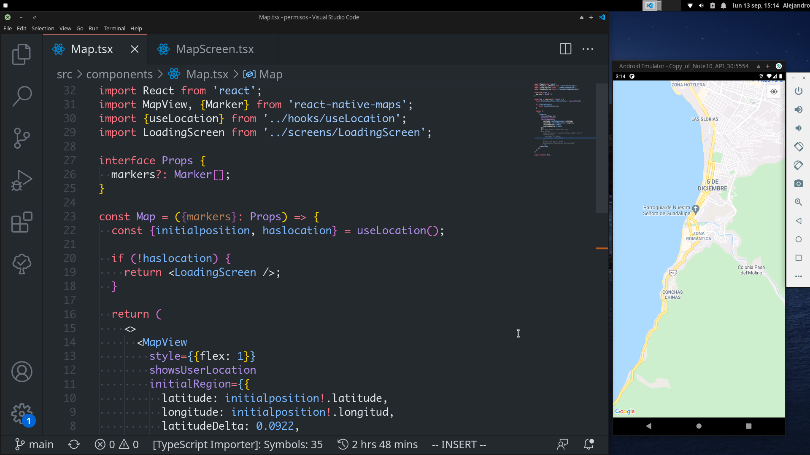
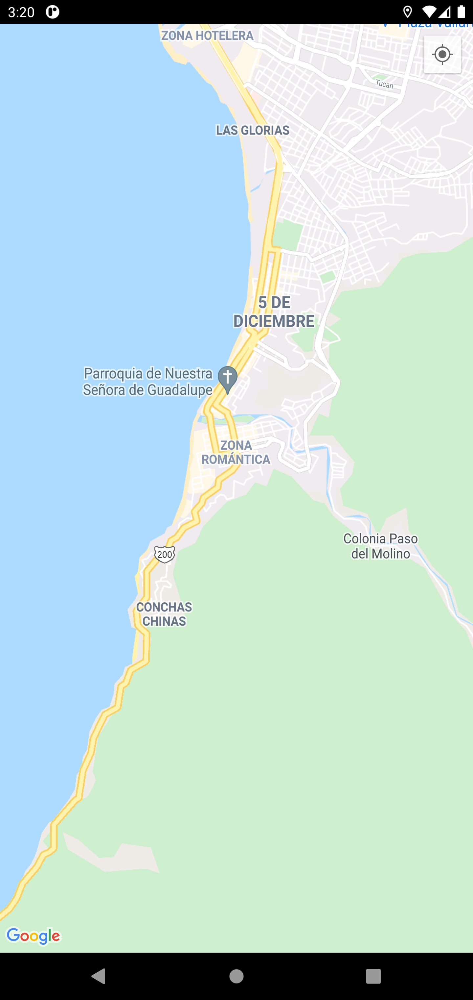

## Reconstruir los módulos de node:

```
npm i
```

_Nota: Proyecto solo enfocado en Android..._

### Tecnologías utilizadas para este proyecto:

- React native CLI
<hr>

### Documentación utilizada:

- https://github.com/react-native-geolocation/react-native-geolocation
- https://github.com/react-native-maps/react-native-maps

Imágenes del proyecto:




